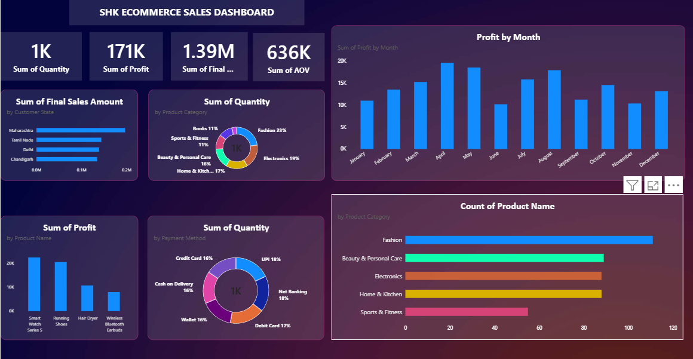

# 🛒 SHK E-commerce Sales Dashboard

## 📊 Project Overview

An interactive Power BI dashboard developed to analyze e-commerce sales performance and generate meaningful business insights.

The dashboard provides an overview of sales, profit, quantity, Average Order Value (AOV), product categories, payment methods, customer locations, and monthly performance.

## 🎯 Project Objectives

- Analyze overall e-commerce sales performance
- Track total sales, profit, and quantity
- Analyze Average Order Value (AOV)
- Compare product category performance
- Analyze sales by payment method
- Analyze customer locations
- Identify monthly sales and profit trends
- Create an interactive and visually appealing business dashboard

## 📈 Dashboard KPIs

The dashboard includes the following key performance indicators:

- **Total Quantity**
- **Total Profit**
- **Total Final Sales Amount**
- **Average Order Value (AOV)**

## 🔍 Analysis Covered

### Sales Analysis
- Sales by customer state
- Total sales performance
- Monthly sales and profit trends

### Product Analysis
- Sales by product category
- Quantity by product category
- Product performance

### Payment Analysis
- Quantity by payment method
- Comparison of different payment methods

### Profit Analysis
- Profit by month
- Profit by product
- Overall profit performance

## 🛠️ Tools & Technologies

- **Power BI**
- **Power Query**
- **DAX**
- **Data Visualization**

## 🖼️ Dashboard Preview

## 📂 Project Files

| File | Description |
|---|---|
| `SHK_Ecommerce_Sales_Dashboard.pbix` | Power BI dashboard file |
| `SHK_Ecommerce_Sales_Dashboard.png` | Dashboard preview image |
| `README.md` | Project documentation |

## 📌 Skills Demonstrated

- Data Cleaning
- Data Transformation
- Data Analysis
- Power Query
- DAX
- KPI Development
- Data Visualization
- Dashboard Development
- Business Intelligence

## 💡 Key Insights

The dashboard enables users to analyze e-commerce performance from multiple perspectives, including product categories, customer locations, payment methods, monthly trends, sales, quantity, and profitability.
